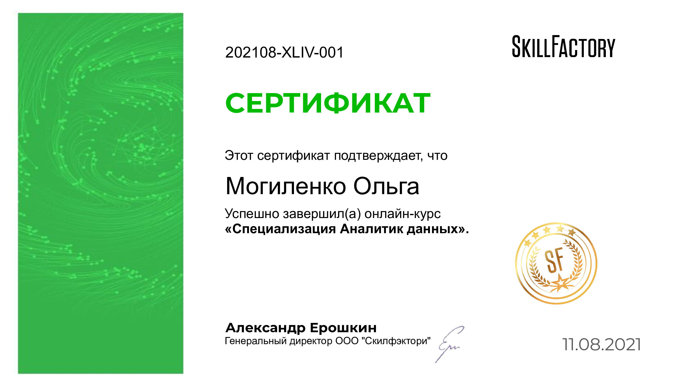
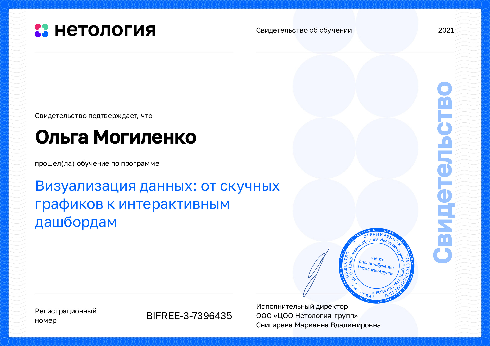
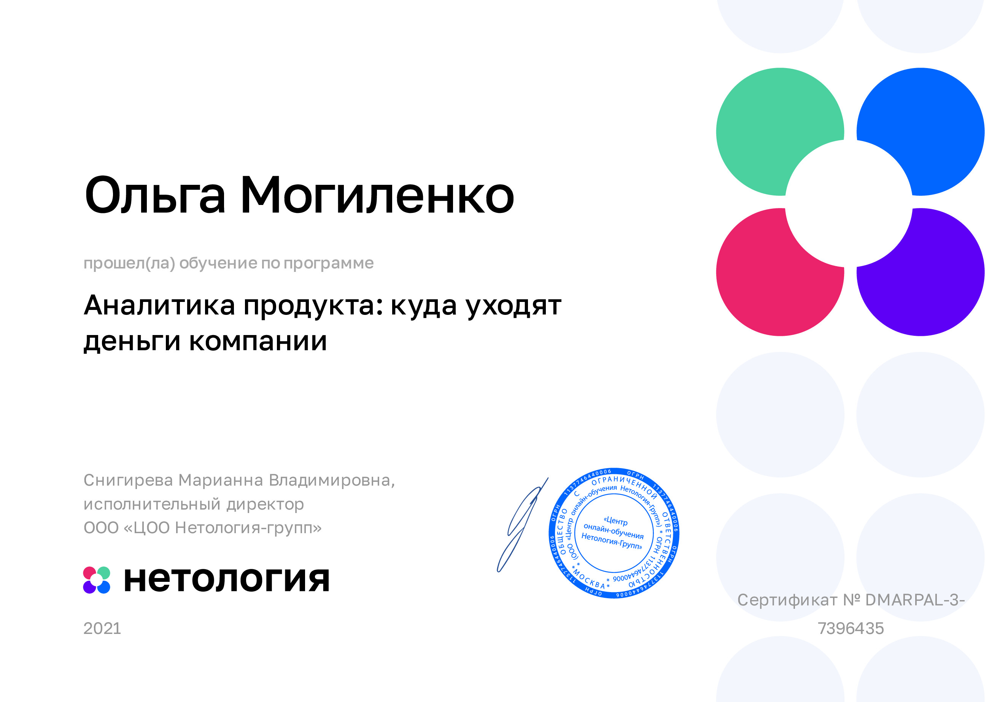
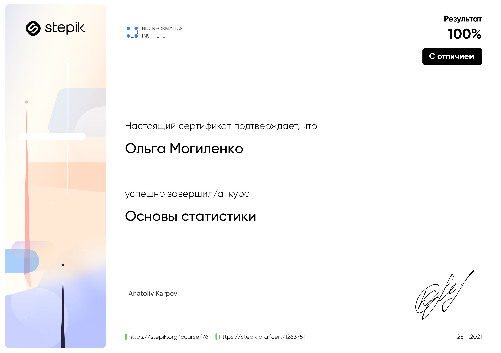

# Hi there 👋

My name is Olga and I'm data analyst.   
I venture to wear new career way. From november 2020 every day increases my level of expertise in data analytics 💪 
<body>
  

    
    
    
    
    
  

 </body>

<!--
**AshtaLaVista/AshtaLaVista** is a ✨ _special_ ✨ repository because its `README.md` (this file) appears on your GitHub profile.

Here are some ideas to get you started:

- 🔭 I’m currently working on ...
- 🌱 I’m currently learning ...
- 👯 I’m looking to collaborate on ...
- 🤔 I’m looking for help with ...
- 💬 Ask me about ...
- 📫 How to reach me: ...
- 😄 Pronouns: ...
- ⚡ Fun fact: ...>

- <body>
  

    
    
    
    
  

 </body>
